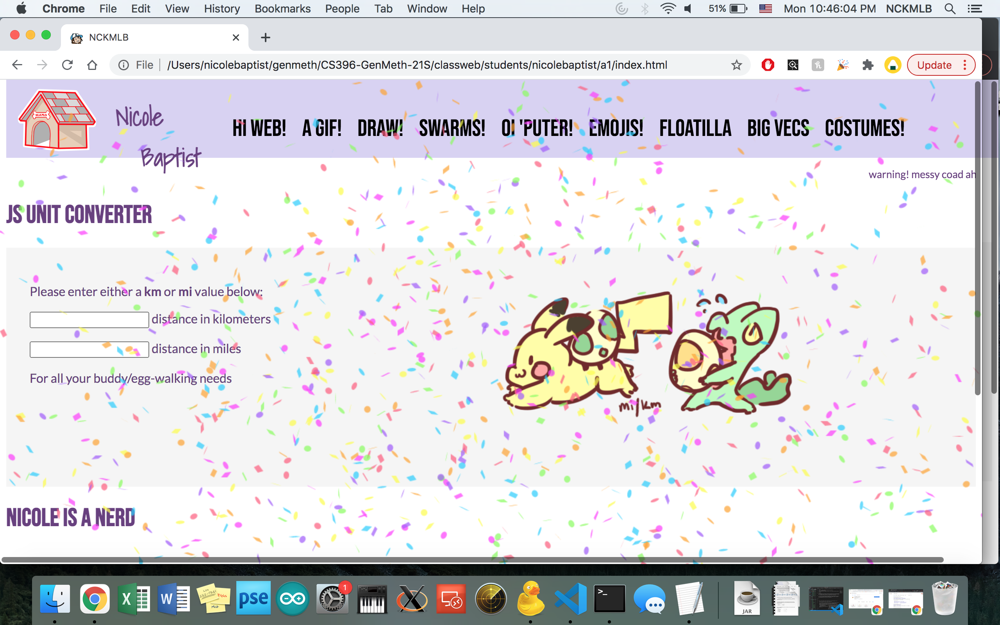
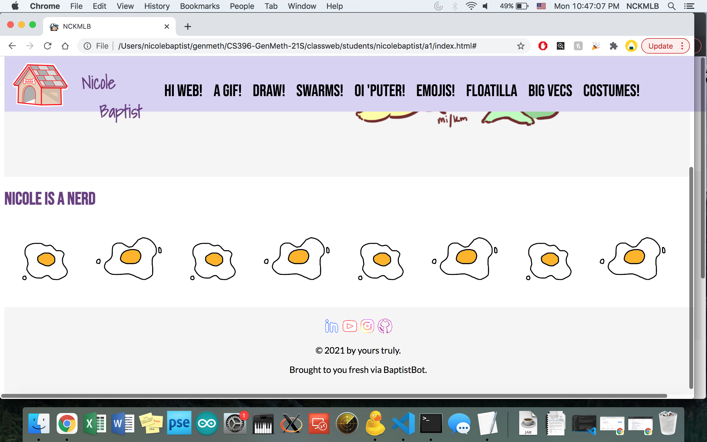
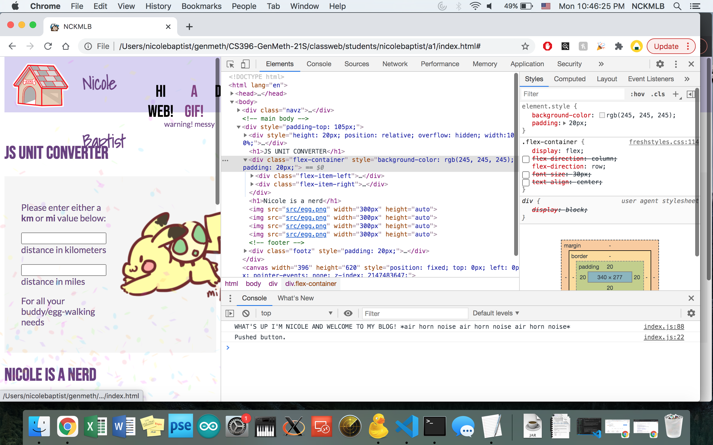
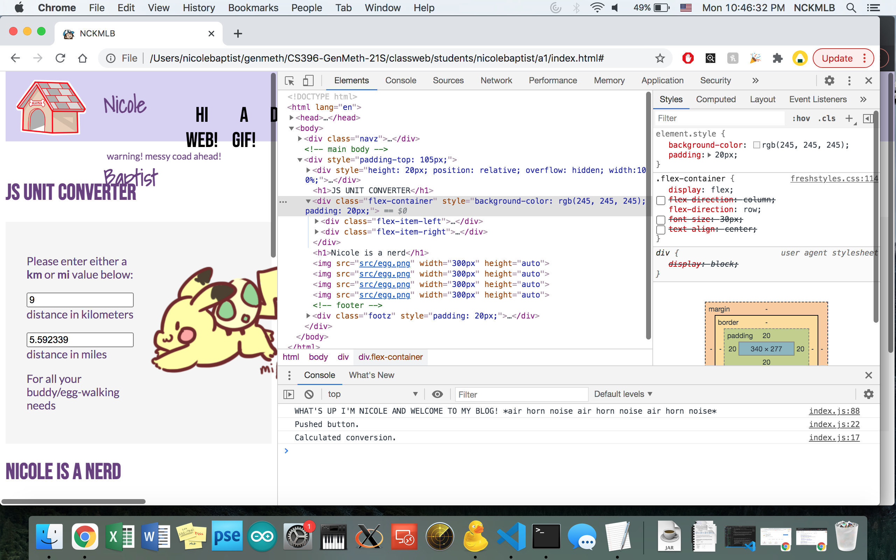

Hello, Web! (Assignment 1)
===
aka Nicole waves hi to the internet
 
 

**Overview**

Make a web page with HTML, JS, and CSS, and share it with the crew using Git.
 

**Features**

The (stolen) function from the homework [instructions](https://github.com/galaxykate/CS396-GenMeth-21S/blob/main/a1.md) was combined with a confetti cannon function (from [here](https://github.com/tobysmith568/Confetti-Chrome-Extension/blob/master/src/inject.js)) logs a happy little greeting to the console upon loading.

Scroll through for some silly drawings!

All links on the top (for assignments) currently only log to the console. 
&emsp; Note: this logs to the console, "Pushed button."
(Well, all except for the <code>Hi Web!</code> link, which refreshes the page.)
&emsp; (Which then of course re-triggers the happy little greeting.)

There's a little disclaimer at the top for any who dares to look at my code...

Enter a number into either the <b>km</b> box or the <b>mi</b> box for a conversion! 
&emsp; Note: this will also log to the console, "Calculated conversion."
This was done referencing [this](https://www.w3schools.com/js/tryit.asp?filename=tryjs_celsius).

You can also hover over the dog house for a guest appearance! 
&emsp; Clicking on it can be used to return to the class homepage.

The footer doesn't really do anything, but I do like me a clean footer, so there it will remain.

Fonts are all taken from online (I believe they're all from google fonts, but the Lato one is from an old project, so I don't really remember...)

All art is 100% done by yours truly :)
 

scrolling | button pushed | value converted
:-------------------------:|:-------------------------:|:-------------------------:
 |  | 

**Acknowledgements**

Huge shoutout to w3schools for teaching me pretty much everything I know about web design.
If you see anything fancy on here, chances are I've learned it from them.

&emsp; Note: if there's a feature you're interested in, but it's not sourced, feel free to ask!

&emsp; Probably woulda put a link in my old websites' code, but have been mostly pulling from memory.

Another shoutout to google fonts for free stuff!

&emsp; Fonts used: Shadows Into Light (Kimberly Geswein), Bebas Neue (Ryoichi Tsunekawa), and Lato (Łukasz Dziedzic)

And thank YOU for reading!