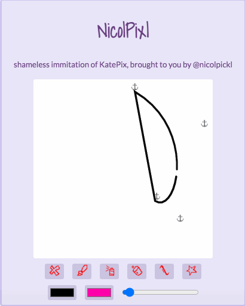

NicolPixl! (Assignment 3)
===
aka the real blast from the past
 
 

**Overview**

Make your own KidPix! Create a webpage with a P5 canvas. As the user draws, create some surprising marks on the page. Include at least 3 buttons that activate 3 different drawing tools, and one erase-screen button. At least one tool should use P5's splines or Bezier curves.

A full preview featuring all features!

**Features**

BRUSH TOOL

- draws a simple line

AIR BRUSH TOOL

- draws a slightly broader line of lower opacity

ERASER TOOL

- erases along path (technically just draws white to match the background)

CURVE TOOL

- adjust the anchors (see what I did there) to modify the curved shape
- has a little funky business going on between the two endpoints, but hey! A curve is a curve, and off-GIF, that connecting line looks a lot more faded (or maybe that's just my old computer...)

POLYGON TOOL

- currently broken :( but is in the works :)
- I was also gonna put tooltips on the buttons, but I got a little caught up with tool formatting ^^;

Icons done by me! All code credits can be found in the respective files!

**Acknowledgements**

Shoutout to p5js.org again! I'm still a little stuck on some stuff, but they reminded me of value orders for all the different shape/line/etc functions.

Special shoutout to Professor Compton as well, as much of this code was very much based off of what she provided us. Couldn't have done this one without her!

As always, shoutout to google fonts for free stuff!

&emsp; Fonts used: Shadows Into Light (Kimberly Geswein), Bebas Neue (Ryoichi Tsunekawa), and Lato (Łukasz Dziedzic)

Last, but certainly not least, thank YOU for reading!