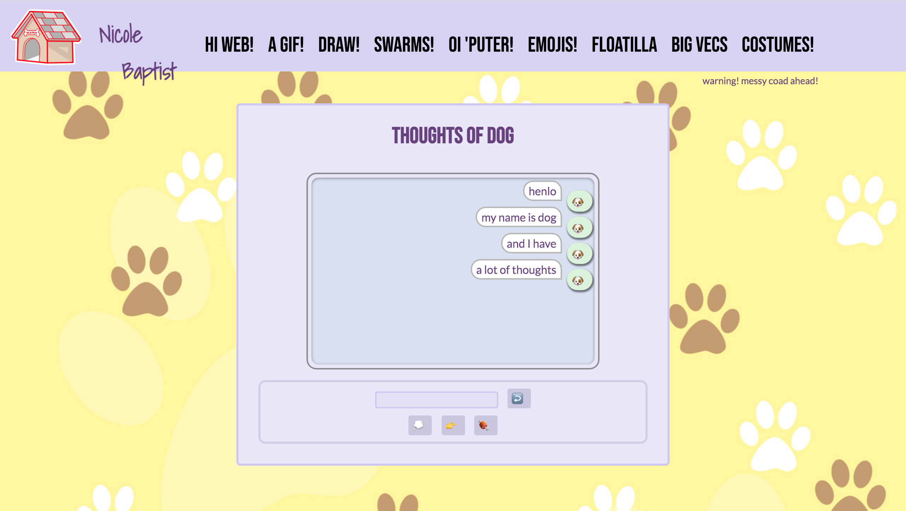

Oi, 'Puter! (Assignment 5)
===
aka dogeBot
 
 

**Overview**

Using Tracery and Vue, create a chatbot that the player can "talk" to. You need to have some UI element for the user's input (a text box, multiple choice chips, or voice input) and some UI element to display the bot's output.

 

<small>
The delay in the initial message generation is supposed to immitate the humorously fragmented hypothetical thought process of a dog
</small>

**Features**

Introducing Dog, a friendly companion with a lot of thoughts that they'd like to share with you! Dogs hobbies incude eating, thinking to people (and things), and getting booped. Dog also likes receiving compliments, but can be easily confused. Have fun with Dog!

 

<code>💭</code> <i>(thoughts)</i>: generates random dog thoughts

Input anything that includes any of the following terms:

* thoughts
* thought
* think

or click on the 💭 (thought bubble) emoji.

<code>👉</code> <i>(boop)</i>: generates a random boop gif/image

Input anything that includes the term "boop"

or click on the 👉 (pointer) emoji.

<code>🍖</code> <i>(treat)</i>: generates a random dog thought/comment relating to food and eating

Input anything that includes any of the following terms:

* snack(s)
* treat(s)

or click on the 🍖 (meat) emoji.

<code>❓</code> <i>(confused)</i>: generates a random confused dog gif

Any input that does not contain one of Dog's favorite words will result in some confusion. Dog will get it eventually!

<code>🥚🐇</code> <i>(easter eggs)</i>: additional built-in responses to common dog interactions/reactions and a few of their variations

hello there! | good dog! | aww, cutie!
:-------------------------:|:-------------------------:|:-------------------------:
 |  | 

Please see bot.js for full list of Dog's additional favorite words

 

**Acknowledgements**

Based on the incredible twitter account, Thoughts of Dog® (@dog_feelings), which never ceases to brighten my day.

The adorable paw print background is originally from [Itchy & Scratchy Dog Home Boarding & Walking](https://www.496fba71-f1dc-45df-90b0-06b3ad977239.com/prices). I thought it was a nice color scheme and that it looks just like the animal crossing wall paper (and I was too swamped to draw D:).

Huuuuge shoutout to Professor Compton for providing us with such nice code!
Tracery is the bomb.

Fonts are all still taken from online!

Fonts used: Shadows Into Light (Kimberly Geswein), Bebas Neue (Ryoichi Tsunekawa), and Lato (Łukasz Dziedzic)

And thank YOU for reading!