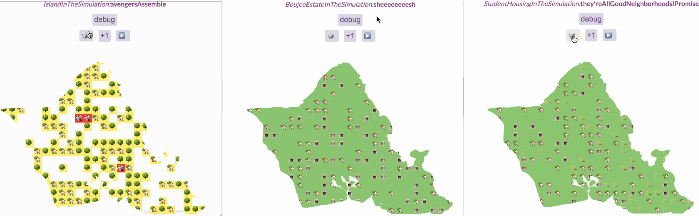
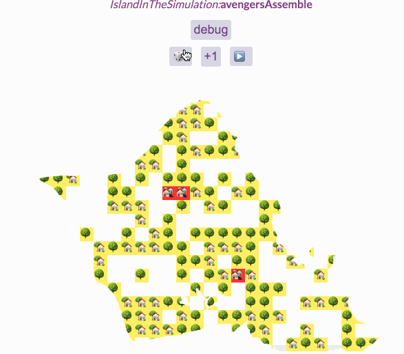
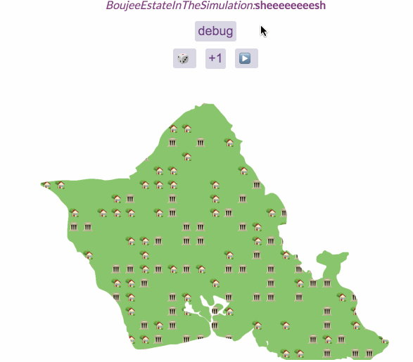

In This Essay I Will... (Assignment 6)
===
aka Nicole likes data visualization (and is a little serious for once)
 
 

**Overview**

Create a custom Game-of-Life cellular automata, similar to Nicky Case's Emoji Simulator app. Create a web page with a grid of emoji (or other display), and update them each frame according to some rule. The user can also "paint" emoji into the grid as it is updating. Each grid cell may be empty or have an emoji, but yiuo can also add visualization elements like borders or backgrounds around each cell. You may also want to display additional output outside the grid.

Before COVID, the housing problem back home has been one of the most discussed issues (news channels even had custom transition titles that they used every day). Real estate has become such a huge investment, but not all residents were ready for that...or the rapidly increasing cost of living. Despite growing up with it always on the news, I'm certainly no expert on the issue. However, I know that it has been a burden on friends and family, and I figured if I was going to be remotely serious about anything, it might as well be something like that. (I've also had that picture of the humuhumu throwin shaka truck for ages and needed to share it with someone.)

**The Argument**

Hawai‘i housing prices are very expensive, and it's becoming a problem.  

While they're not particularly complicated and are based on my very basic understanding of the issues, I think the simulations "worked" in that they illustrate the very bare-bones points of the situation/argument.

**Simulations**

ISLAND IN THE SIMULATION (avengersAssemble)

- https://www.youtube.com/watch?v=HVHUjzZZGQ4&ab_channel=Sandrova92

- Simulates the rapid urbanization of "The Gathering Place" (the island with our state capital) where houses and trees are replaced with even more houses

- Eventually all original (historic?) houses and trees are replaced with a cluster of houses. While no place is really "safe" from the growing population and search for housing, the west and north shores are still a lot more country than the rest of the island (so the simulation can be a little less accurate there, depending on where the mansions spawn)

- Some cells were purposefully left empty, as not all land is developable

- The logic behind this one is:

<code>

    if (Math.random() < .2)
        return {emoji:"🏡"};
    else if (Math.random() < .4) 
        return {emoji:"🌳"};
    else if (Math.random() < .04)
        return {emoji:"🏘️"};
</code>

Where all properties will eventually become crowded with houses due to:

<code>

    if (NeighborCount >= 1){
        if (Math.random() <= this.factor) {
            return {emoji:"🏘️"};
        }
    }
</code>

BOUJEE ESTATE IN THE SIMULATION (sheeeeeeeesh)

- Illustrates the increasing market value of property throughout the island through tile brightness (brighter --> more expensive)

- The increase in brightness starts with the mansions, but it spreads out to all the other houses as well (and it's very fast!)

- Some houses are left unreachable. This wasn't done on purpose, but I guess they could represent public housing stuff

- There is a pretty even, random spread of houses and estates using:

<code>

    let chance = Math.random() * 7

</code>

I was a little lazy, so I didn't make a lot of code changes from Quinton (sorry dude!), but it changes the tile brightness with this

<code>

    if (this.teachesPeers[n[0]][n[1]] == true) {
        numTeachingNeighbors += 1
    }
</code>

STUDENT HOUSING IN THE SIMULATION (they'reAllGoodNeighborhoodsIPromise)

- Also simulates the increasing property values over time, but this version includes some more affordable housing on the map to add some diversity

- The cost (tile brightness) change is a lot slower in this simulation and the variety is more random across the map

- While the estates are still very expensive, the more affordable units aren't necessarily "poorer" areas; in fact, some turn out to be as fancy as the estates which is...ironic, but yknow

- I'm really not sure how Hawai‘i plans to solve this issue, or if there's even a way to do so that'll keep everyone happy, but at the very least you have to admit that is one aesthetic simulation

- This one works similarly to the previous simulation, but it includes a split between estates and affordable housing:

<code>

    if (this.teachesPeers[x][y]) {
        let sides = ['heads', 'tails'];
        let flipacoin = random(sides);
        if (flipacoin === 'tails') {
            return "🏛"
        }
        else {
            return "🏗"
        }
    }
</code>

It also propegates the brightness based on chance:

<code>

    if (this.teachesPeers[n[0]][n[1]] == true) {
        if (this.emoji[x][y] === "🏛") {
            numTeachingNeighbors += 1
        }
        else if (this.emoji[x][y] === "🏗") {
            let sides = ['heads', 'tails'];
            let flipacoin = random(sides);
            if (flipacoin === 'tails') {
                numTeachingNeighbors -= 1
            }
            else {
                numTeachingNeighbors = numTeachingNeighbors
            }
        }
    }
</code>

All pictures taken by me! The O‘ahu shape was taken from somewhere on the internet, but I edited it to make the layer mask.

**Acknowledgements**

Shoutout to p5js.org again! There were a lot of small details that I used (like Math.random()) that I needed the documentation to implement.

Special shoutout to Professor Compton as well, as much of this code was very much based off of what she provided us. Couldn't have done this one (or any of these tbh) without her!

Additional gratitude this week goes to my awesome classmates:

<b>David Lee</b> for his code used to import images

<b>Yael Ben Shalom</b> for her help fixing the first simulation's debugger

<b>Quinton Nickum</b> for his tile color changing code that looks waaay better than my own attempt

As always, shoutout to google fonts for free stuff!

&emsp; Fonts used: Shadows Into Light (Kimberly Geswein), Bebas Neue (Ryoichi Tsunekawa), and Lato (Łukasz Dziedzic)

Last, but certainly not least, thank YOU for reading!