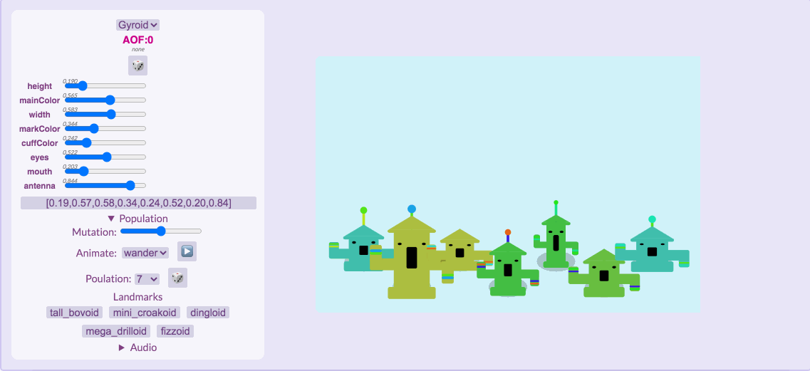
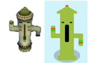
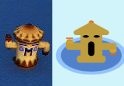
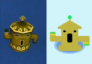
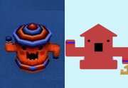
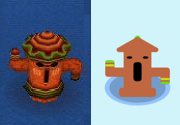

Floatilla! (Assignment 7)
===
aka Nicole gets peer pressured back into animal crossing
 
 

**Overview**

Create a function that takes an array of floats and returns some art: a "catification" algorithm like the one that turns Cryptokitty tokens into Cryptokitty art. Your art may be L-system flowers, particle systems, procedural faces, abstract art, spaceships, or anything you want to come up with. Consider that all the tuning sliders from previous assignments were practice for making a design with a bigger array of sliders.
 

**Features**

This catification algorithm produces randomized arrays of gyroids (from the Animal Crossing franchise), which are friendly, colorful, rhythmic totem-like creatures/furniture. I was inspired by the way that, while families of gyroids typically share color palettes and physical features, the 127 variations leave a lot of room for creativity.

Certain features of these gyroids can be controlled dynamically through slider input. They are the following:

<ul>
    <li> <b>height:</b> the trunk height of the gyroid (short <--> tall)
    <li> <b>mainColor:</b> the main color of the gyroid
    <li> <b>width:</b> the gyroid trunk (and arm) width (narrow <--> wide)
    <li> <b>markColor:</b> ngl, I wanted to do squigglies on them or something, but tragically ran out of time, so it's really just a secondary cuff color (the mark closer to the "hand" of the gyroid and at the end of the antenna)
    <li> <b>cuffColor:</b> the actual cuff color (and antenna stem color)
    <li> <b>eyes:</b> the shape of the gyroid's eyes (sleepy <--> wide)
    <li> <b>mouth:</b> the shape and length of the gyroid's mouth (shorter/squarer <--> longer/rounder)
    <li> <b>antenna:</b> the antenna length/general existence of the gyroid's antenna (none <--> tall)
</ul>

**Landmarks**

I based the landmarks as best I could on actual gyroids found in the games (as seen [here](https://animalcrossing.fandom.com/wiki/Gyroid_(furniture)))! 

tall bovoid | mini croakoid | dingloid | mega drilloid | fizzoid
:-------------------------:|:-------------------------:|:-------------------------:|:-------------------------:|:-------------------------:
 |  |  |  | 

In conclusion, I set out to make cute wavey sound effect robots and ended up with boppin disco space chimneys.

**Acknowledgements**

Shoutout to p5js.org again for the fantastic documentation!

Shoutout to Professor Compton as well, as much of this code was very much based off of what she provided us. Couldn't have done this one (or any of these tbh) without her!

As always, shoutout to google fonts for free stuff!

&emsp; Fonts used: Shadows Into Light (Kimberly Geswein), Bebas Neue (Ryoichi Tsunekawa), and Lato (Łukasz Dziedzic)

Last, but certainly not least, thank YOU for reading!