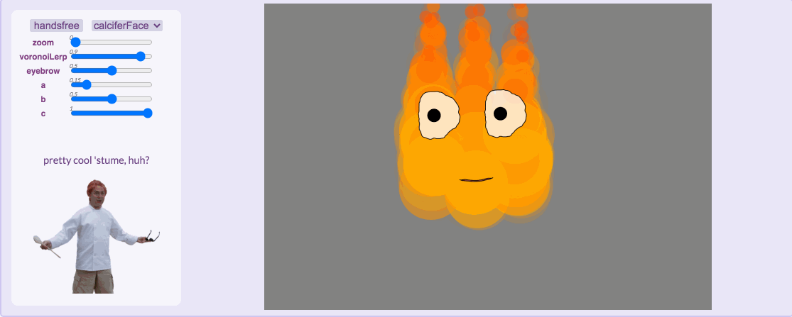
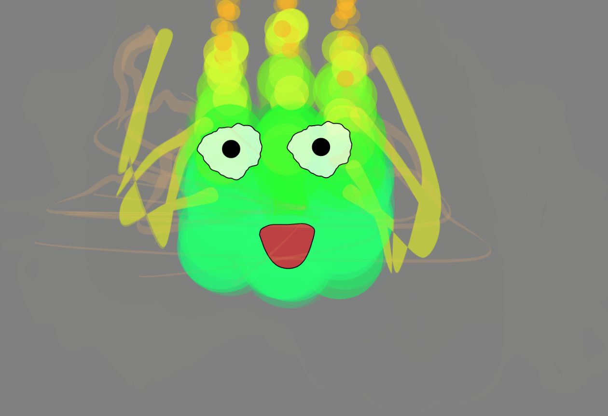
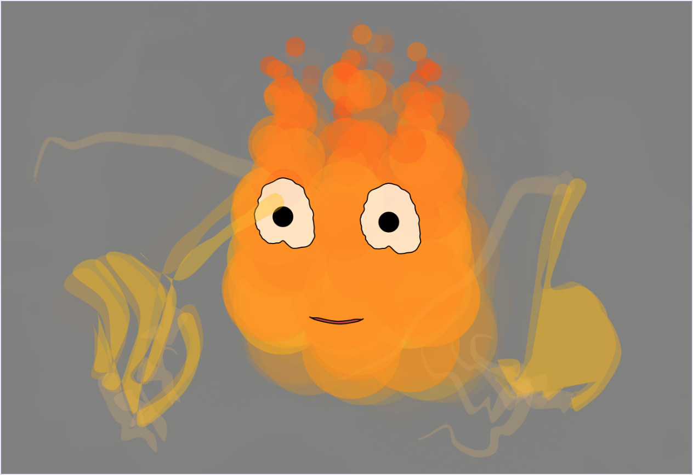
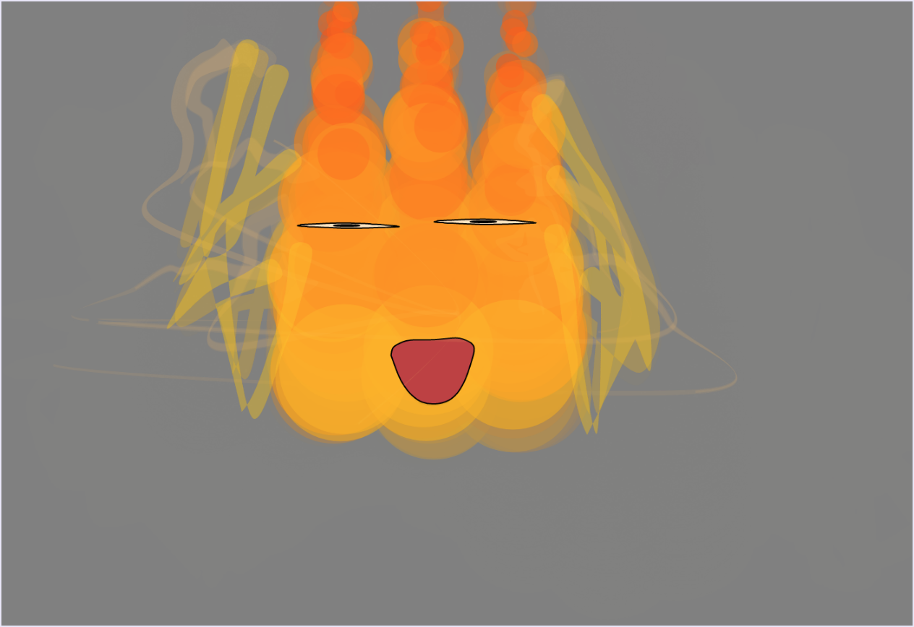

Costumes! (Assignment 9)
===
aka https://youtu.be/UIiRR0zyipE?t=53
 
 

**Overview**

Using handsfree.js make a function that takes continuous tracking data (an array of vectors), and turns it into P5 graphics. You can layer it on top of the real video feed or make an all-virtual world. You can use particles, Voronoi diagrams, KDtrees, curves, or any of the (previously learned techniques or something, probably)

 

**Features**

This virtual mask is based on the character Calcifer from Howl's Moving Castle

Once I realized that my computer did not in fact have trypophobia and was just grouchy that I accidentally asked it to draw a billion circles six times, the time taken to put the rest of the mask together was embarrassingly short compared to the amount of time spent photoshopping Charles Boyle (worth it though). At least it makes for an interesting anectdote. 

Certain features of Calcifer can be controlled dynamically through slider input:

*Hue (a)*: Calcifer's colors can be changed to (sort of) match that of the movie. Use this slider to change between red-orange and ~green.

movie | mask |
:-------------------------:|:-------------------------:
 | 

*Noise/"Size" (b)*: Calcifer, due to his lack of a nose, eyebrows, and a body in general, often expresses himself by cranking up the juice. Use this slider to change the amount of noise (flickering) and (albeit very slightly) the width of Calcifer.

movie | mask |
:-------------------------:|:-------------------------:
 | 

*Eye "menacingness" (c)* Calcifer has a lot of responsibilities; needless to say, he can get a little sassy. Use this slider to either open or close Calcifer's eyes.

movie | mask |
:-------------------------:|:-------------------------:
 | 

**Acknowledgements**

Shoutout to p5js.org again for the fantastic documentation!

Shoutout to Professor Compton as well, as much of this code was very much based off of what she provided us. Couldn't have done this one (or any of these tbh) without her!

Special shoutout to Carlyn Savino for the not-blocky hand code and to natureofcode for [this](https://editor.p5js.org/natureofcode/sketches/8I_oLZqDt)!

As always, shoutout to google fonts for free stuff!

&emsp; Fonts used: Shadows Into Light (Kimberly Geswein), Bebas Neue (Ryoichi Tsunekawa), and Lato (Łukasz Dziedzic)

Last, but certainly not least, thank YOU for reading!